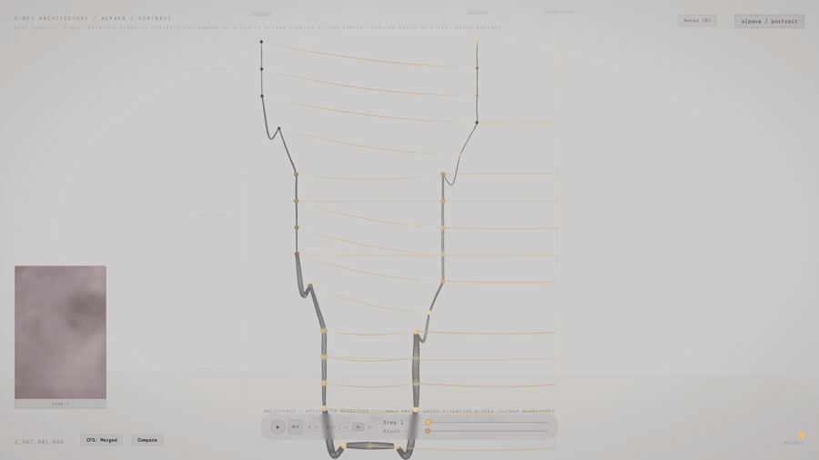
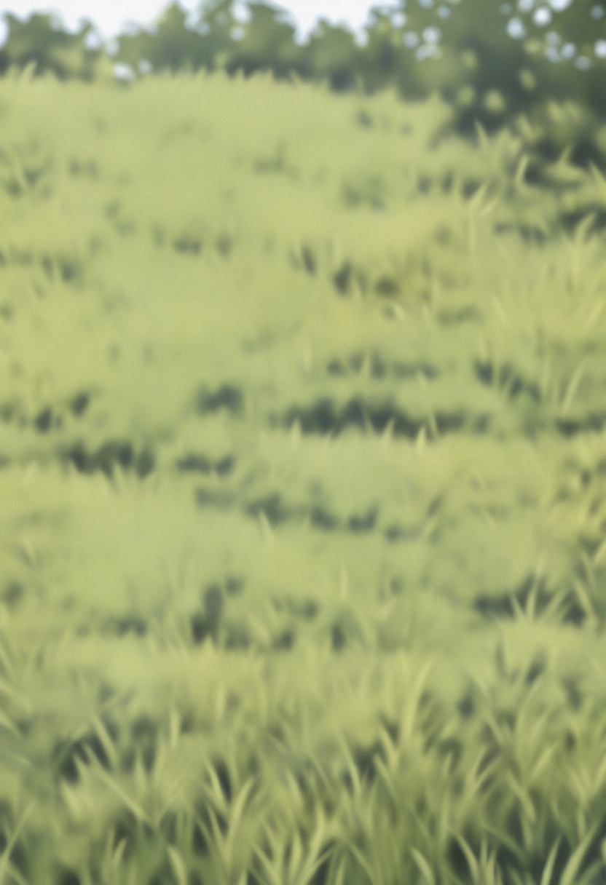
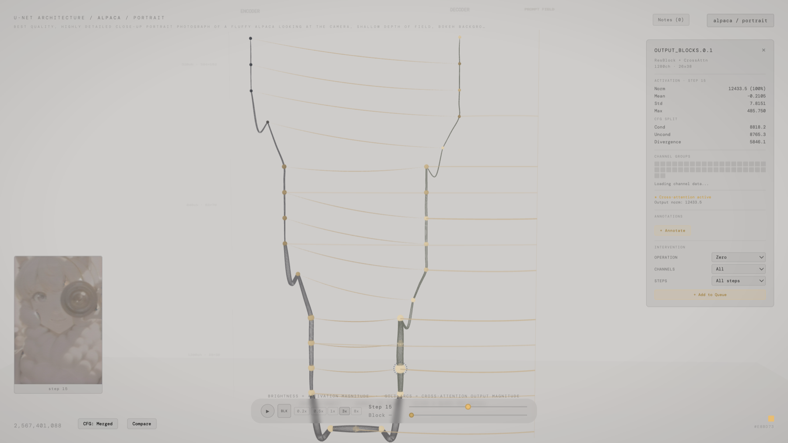
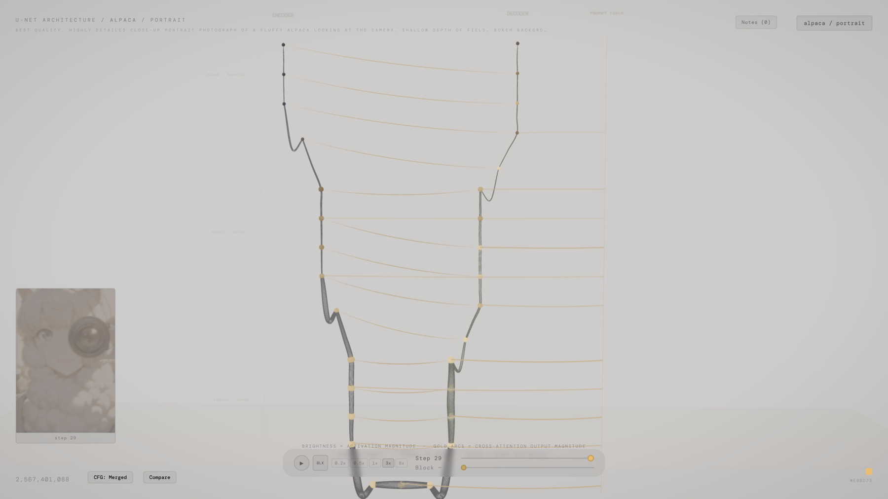

# SDXL U-Net Activation Visualizer

Capture, visualize, and causally edit the internal activations of a Stable Diffusion XL U-Net mid-generation — zero, amplify, or clamp a block's output during the live forward pass and watch the generated image change.

[Live demo](https://ppikkuaho.github.io/unet-activation-visualizer/) · [](LICENSE)



## Headline result: editing a U-Net block changes the image it generates

The intervention engine edits a block's output tensor *in place during the forward pass* — zeroing, amplifying, or clamping selected channels at selected diffusion steps — so the downstream generation reflects the edit. This is a causal probe, not a passive readout: it is counterfactual probing of a generative model's internals, run as a controlled experiment.

Holding the prompt and seed fixed (a standing alpaca, seed 42) and editing one block at a time:

   

From left to right: the baseline; `middle_block.1` amplified by 2x, where the subject grows and dominates the frame; `middle_block.1` zeroed, where the subject shrinks and the scene recomposes; and `output_blocks.0.1` zeroed, where the subject fails to form at all. Scaling the bottleneck cross-attention block dials the subject's prominence; zeroing an early-decoder cross-attention block removes it entirely. These reproduce from `activation-mapping/scripts/intervene_demo.py`.

**Why this is hard.** Two things have to be right for the edit to be causal rather than cosmetic. First, the edit has to land *inside* the live forward pass: the hook mutates the block's output tensor in place before it flows on to the next block, so every downstream computation sees the edited activation and the final image is genuinely a different generation — not a recolored replay of the original. Second, classifier-free guidance runs the conditioned and unconditioned latents through the U-Net together in a single batch, so a naive per-step capture mixes the two. A `set_model_unet_function_wrapper` records ComfyUI's `cond_or_uncond` ordering on each forward pass, letting the hook split the batch and attribute every statistic — and every intervention — to the correct half.

## What it is

SDXL U-Net Activation Visualizer is an interactive browser tool for inspecting and editing the internal activations and cross-attention of a Stable Diffusion XL U-Net as it denoises an image. The network's 32 blocks are laid out as a 3D U-shape — an encoder arm descending to a three-block bottleneck and a decoder arm ascending back up — and each block is lit by the magnitude of its activation at the current denoising step. The eleven cross-attention blocks are linked by arcs to a prompt field. Several views each offer a different lens into where the model's computation concentrates, alongside the intervention engine above. The visualization runs on captured data committed to the repository, with no build step and no Python required.

It measures activation *magnitude* — per-block L2 norms, and the output magnitude of the attention-bearing blocks — rather than per-token attention-weight maps. For token-level attribution, see [DAAM](https://github.com/castorini/daam).

## Views

### The 3D scene

The main view renders all 32 U-Net blocks as spheres along the U-shape. Each sphere's brightness is the L2 norm of that block's output, normalized against the per-step 5th-95th percentile range so that a few high-magnitude blocks do not wash out the rest. Scrubbing the step slider advances through the 29 diffusion steps, and the activation pattern evolves alongside the decoded preview image.

### Cross-attention

The eleven gold arcs connect the cross-attention blocks to a vertical prompt field. Each arc's brightness reflects that block's output-feature magnitude at the current step: the full residual output of the SpatialTransformer, and therefore a coarse activity proxy rather than an isolated measure of cross-attention.

### Block detail

 

Selecting a block opens a panel with its activation statistics (norm, mean, standard deviation, maximum), the conditioned-versus-unconditioned (CFG) split, the per-channel norms grouped into 64-channel bins, a cross-attention indicator, and an intervention builder. The full per-channel profile is loaded on demand when the panel is opened. The image on the right shows a later denoising step, after the preview has largely resolved; the late-step activation pattern is visibly different from the mid-denoising one.

### Intervention builder

The block-detail panel is also where interventions are authored. A configuration — block, operation, channels, magnitude, and the steps it applies to — is assembled in the interface and exported as JSON, then replayed through the capture pipeline to produce the kind of result shown at the top of this README.

### Compare

Two profiles can be loaded together, with each block colored by the difference in activation magnitude between them.

## How it works

The project is two Python stages feeding a single-file front-end.

1. **Capture.** `activation-mapping/scripts/activation_engine.py` drives SDXL inference through ComfyUI's sampler and registers PyTorch forward hooks on every U-Net block. Thirty-two distinct blocks emit per-step statistics, and each of the eleven cross-attention blocks carries a second hook for its output-magnitude summary. For each block at each step it records the activation norm, mean, standard deviation, and maximum; the per-channel L2 norms; the cross-attention output-magnitude summary; and the classifier-free-guidance split (via the `cond_or_uncond` batch-ordering wrapper described above). A preview image is decoded at every step, and interventions are applied in place.

2. **Preprocess.** `preprocess_for_viz.py` reduces each full profile to a roughly 550 KB `*.viz.json`: scalar statistics, per-channel norms binned into 64-channel groups, percentile-clipped (p5-p95) normalization bounds, and the attention and CFG summaries, together with an `index.json` registry. The heavy per-channel profiles (about 15 MB each) remain on disk and are fetched only when the channel drilldown is opened.

3. **Visualize.** `index.html` is a self-contained Three.js application that loads the slim JSON, lays out the 32 blocks in 3D, and runs all interaction in the browser. The core payload is about 10 MB, with no build step and no runtime CDN.

See [ARCHITECTURE.md](ARCHITECTURE.md) for the data schema, the block registry, and the scene structure.

## Getting started

The visualizer runs entirely in the browser on the committed example data; no Python and no build step are needed. It must be served over HTTP, as the application uses `fetch`, which browsers block on `file://`:

```bash
git clone https://github.com/ppikkuaho/unet-activation-visualizer
cd unet-activation-visualizer
python3 -m http.server 8000
# open http://localhost:8000
```

Three.js 0.163 and the interface font are vendored under `vendor/`, so the page works fully offline.

## Regenerating the data

This step is optional, and only needed to capture new profiles. It requires a working [ComfyUI](https://github.com/comfyanonymous/ComfyUI) installation and an SDXL `.safetensors` checkpoint of your own; no model weights are shipped with this repository.

```bash
pip install -r requirements.txt           # torch, numpy, pillow
export COMFYUI_DIR=~/ComfyUI              # path to your ComfyUI install
export ACTIVATION_CKPT=/path/to/your/sdxl-checkpoint.safetensors
python activation-mapping/scripts/capture_neutral.py   # ~3 min/profile on Apple Silicon (MPS)
```

`capture_neutral.py` captures the two example profiles and then runs the preprocessor; edit its `PROFILES` list to capture your own prompts.

## What it can and cannot tell you

The tool can show relative activation magnitude per block and per step, the output-feature magnitude of the attention-bearing blocks (residual included, and therefore a coarse proxy rather than isolated cross-attention), the conditioned/unconditioned divergence, and the causal effect on the output image of zeroing, amplifying, or clamping activations.

It cannot show which prompt tokens attend to which pixels: it captures attention *output magnitude*, not the per-token softmax(QK^T) matrix (for token attribution, see [DAAM](https://github.com/castorini/daam)). Activation magnitude is a coarse, post-hoc signal, softer still than attention weights, which are themselves [contested as explanations](https://aclanthology.org/P19-1282/) (Serrano and Smith, *Is Attention Interpretable?*, ACL 2019). The magnitude views are best read as a map of *where* computation concentrates, not *why* — the causal interventions are the part that establishes *what a block controls*.

## Data and model provenance

The example data under `activation-mapping/` is model-derived output, kept separate from the MIT-licensed code:

- Two profiles: an alpaca in two framings (standing and portrait), seed 42, 832x1216, 29 steps, CFG 7.0, euler-ancestral.
- Generated locally with an SDXL checkpoint and no LoRA. The visualizer is model-agnostic, so any SDXL checkpoint works.
- No model weights are included or redistributed; the JSON contains derived statistics (norms, magnitudes, and summaries) only. Supply your own checkpoint to regenerate.
- The images and derived data may be reused under CC BY 4.0.

## License

The code (the Python pipeline and `index.html`) is released under the [MIT License](LICENSE). The example data is model-derived; see the provenance section above.

## Acknowledgements

Built with [Three.js](https://threejs.org/) and [ComfyUI](https://github.com/comfyanonymous/ComfyUI), on Stability AI's Stable Diffusion XL architecture.

Built by Pietari Pikkuaho.
